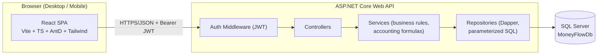
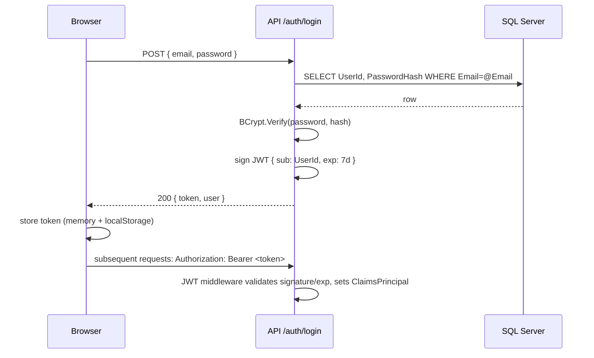

# ARCHITECTURE.md — MoneyFlow

## 1. Overview Diagram



Single monolithic backend, single SPA frontend, single SQL Server database. No microservices, no message queue, no cache layer — unnecessary for a single/low-user personal finance app and would hurt maintainability priority (#10).

## 2. Frontend Stack — Decision

| Concern | Choice | Reasoning |
|---|---|---|
| Framework | **React 18 + TypeScript** | Team familiarity, huge ecosystem, matches AntD |
| Build tool | **Vite** | Instant dev server, fast HMR, simpler than Next.js since we don't need SSR/SEO for a private finance app |
| UI kit | **Ant Design 5** | Requested by developer; rich form/table/date components reduce custom UI code |
| Styling | **Tailwind CSS** | Utility classes for layout/spacing on top of AntD components; requested by developer |
| Data fetching | **TanStack Query v5** | Caching, background refetch, loading/error states out of the box — removes need for hand-rolled global data state |
| Routing | **React Router v6** | Standard, minimal, sufficient for ~10 screens |
| Global client state | **Zustand** | Only for cross-cutting UI state (selected month, auth user, sidebar collapse). Server data stays in TanStack Query — avoids duplicating server state in a store |
| Forms | **React Hook Form** | Performant, uncontrolled inputs, integrates with AntD via `Controller` |
| Validation | **Zod** | Schema validation shared shape between form validation and TypeScript types (`z.infer`) |
| Charts | **Recharts** | Declarative React API, good enough chart types (bar/line/area/pie) for the 4 required dashboard charts, responsive `ResponsiveContainer`, lighter/simpler than ECharts for this scope |
| Date handling | **dayjs** (AntD's default) + a small `buddhist-era.ts` helper for BE display | Avoids Moment.js bloat |

**Rejected:** Next.js (no SSR/SEO need, adds complexity), Redux/Redux Toolkit (overkill vs Zustand + TanStack Query), MUI/Chakra (developer already prefers AntD), ECharts (heavier API surface than needed), Formik (React Hook Form is lighter/faster).

## 3. Backend Stack — Decision

**Chosen: ASP.NET Core 8 Web API + Dapper + SQL Server + JWT Bearer Auth.**

| Option | Verdict | Reasoning |
|---|---|---|
| **ASP.NET Core + Dapper** | ✅ Chosen | First-class SQL Server driver, developer is comfortable with explicit SQL, Dapper maps rows to DTOs with minimal ceremony, excellent perf, mature JWT middleware, single deployable, easy for one developer to maintain |
| ASP.NET Core + EF Core | Rejected | Developer explicitly prefers explicit SQL over heavy ORM abstraction; EF migrations add a second source of truth for schema alongside hand-written SQL scripts (which are still required per spec) |
| Go + net/http or Gin | Rejected | No strong technical reason to switch; would still need a SQL Server driver + more manual JWT/validation plumbing; ASP.NET Core's ecosystem for this exact stack (Dapper + SQL Server + JWT) is more mature |
| Node.js/NestJS + SQL Server | Rejected | SQL Server driver support in Node is weaker than .NET's; would fragment stack (TS backend + TS frontend still fine, but no clear win over ASP.NET Core here) |

### 3.1 Backend Layering

```
Controllers (HTTP concerns: routing, [Authorize], model binding, status codes)
    → Services (business rules: accounting formulas, recurring-copy logic, validation orchestration)
        → Repositories (Dapper; one class per aggregate; raw parameterized SQL, returns POCOs)
            → SQL Server
```

- **Controllers** never contain SQL or business math. They call one Service method and return its result mapped to a response DTO.
- **Services** own the accounting rules from PROJECT_SPEC.md §5 so the formulas exist in exactly one place.
- **Repositories** use Dapper with named parameters (`@UserId`, `@MonthlyPeriodId`, ...) — never string concatenation.
- **Current user resolution**: an `ICurrentUserService` reads `UserId` from `ClaimsPrincipal` (JWT `sub` claim) once per request; it is injected into every Service call. Controllers never read a user id from route/query/body for authorization purposes.

### 3.2 Project Structure

```
/frontend
  src/
    api/            # typed API client functions (fetch wrappers), one file per resource
    components/     # shared UI components (StatCard, MonthSwitcher, QuickAddSheet, ResponsiveTable, ...)
    features/
      auth/
      dashboard/
      income/
      expenses/
      budgets/
      transactions/
      savings/
      categories/
      recurring/
      reports/
    hooks/          # useCurrentMonth, useAuth, etc.
    stores/         # zustand stores (auth.store.ts, month.store.ts, ui.store.ts)
    routes/         # React Router route definitions + layout shells
    schemas/        # zod schemas shared by forms
    lib/            # money formatting, buddhist-era date helper, query-client
    styles/         # tailwind.css, ant design theme overrides
  index.html, vite.config.ts, tailwind.config.ts, tsconfig.json, package.json, .env.example

/backend
  MoneyFlow.Api/
    Controllers/
    Services/
    Repositories/
    Dtos/
      Requests/
      Responses/
    Auth/            # JwtTokenService, PasswordHasher, CurrentUserService
    Common/          # Result<T>, ApiException, middleware (ExceptionHandlingMiddleware)
    Program.cs, appsettings.json, appsettings.Development.json, .env.example
  MoneyFlow.Api.Tests/
    Services/        # unit tests for accounting formulas
    Integration/      # WebApplicationFactory tests incl. data-isolation tests

/database
  sql/
    001_create_database.sql
    002_create_tables.sql
    003_create_indexes.sql
    004_seed_data.sql
  README.md          # how to run scripts against local SQL Server

/docs                # (optional) extra diagrams if needed later

PROJECT_SPEC.md
ARCHITECTURE.md
DATABASE_DESIGN.md
API_SPEC.md
UI_UX_SPEC.md
TASKS.md
README.md
```

## 4. Authentication Flow



- Password hashing: **BCrypt.Net-Next** (`BCrypt.HashPassword`, work factor 11).
- Token: JWT signed with a symmetric key from configuration (`Jwt:Secret`), 7-day expiry, `sub` claim = `UserId`, `email` claim.
- No refresh tokens in v1 (re-login after expiry) — matches "simple login" priority.
- Registration endpoint exists (`POST /auth/register`) since the app must support multiple users, but the UI can keep it minimal (email, password, display name) or be admin-provisioned initially; both are supported by the API.

## 5. Error Handling & Validation

- Global `ExceptionHandlingMiddleware` catches unhandled exceptions → `500` with a generic message (no stack traces to client); logs full exception server-side.
- A typed `ApiException(int statusCode, string code, string message)` lets Services throw `NotFoundException`, `ConflictException`, `ValidationException` mapped to 404/409/400.
- Request DTOs validated via **FluentValidation** (or DataAnnotations if simpler) before reaching Services; validation failures return `400` with a field→message map matching the shape consumed by React Hook Form.
- Every response uses a consistent envelope (see API_SPEC.md §1.2).

## 6. Logging & Observability

- `Microsoft.Extensions.Logging` with console provider (sufficient for single-developer, low-traffic app). Structured log lines include `UserId` and request path.
- No external APM needed for v1 — would violate the "don't over-engineer" guidance.

## 7. Configuration & Secrets

- Backend: `appsettings.json` holds non-secret defaults; secrets (`ConnectionStrings:MoneyFlowDb`, `Jwt:Secret`) come from `appsettings.Development.json` (gitignored) locally and environment variables in any deployed environment. `.env.example` documents required keys.
- Frontend: `VITE_API_BASE_URL` via `.env` / `.env.example`.
- `.gitignore` excludes `appsettings.Development.json`, `.env`, `*.env.local`.

## 8. CORS

- Backend allows only the known frontend origin(s) (`http://localhost:5173` dev, configurable via `Cors:AllowedOrigins` for prod) with credentials disabled (JWT is sent via header, not cookies) — simplest safe CORS policy.

## 9. Testing Strategy (see TASKS.md Phase 11 for concrete tasks)

- **Unit tests** (xUnit): accounting formula Services (Remaining/Food/Reward math), recurring-copy logic — pure functions/services, mocked repositories.
- **Integration tests** (xUnit + `WebApplicationFactory` + a disposable test database or transaction-rollback pattern): auth flow, and **cross-user data isolation** (User A token must never retrieve User B's month/income/expense/transaction by id).
- **Frontend**: no heavy E2E requirement for v1; component-level tests optional/nice-to-have (Vitest + React Testing Library) — not blocking for MVP delivery.

## 10. Deployment Notes (lightweight, single developer)

- Backend: publish as a self-contained ASP.NET Core app or Docker image; run behind IIS/nginx or a small VM/App Service.
- Frontend: static build (`vite build`) served via any static host or the same nginx.
- Database: SQL Server instance (local, LocalDB for dev, or Azure SQL for prod) — connection string only, no infra-as-code required for v1.

## 11. Summary of Key Decisions

| Layer | Decision |
|---|---|
| Frontend | React + TS + Vite + Ant Design + Tailwind + TanStack Query + React Router + Zustand + React Hook Form + Zod + Recharts |
| Backend | ASP.NET Core 8 Web API + Dapper |
| Database | SQL Server, hand-written SQL scripts under `/database/sql` |
| Auth | Email/password + BCrypt + JWT (7-day expiry), no OAuth |
| Architecture style | Layered monolith (Controllers → Services → Repositories), single repo, single deployable API + single SPA |

## 12. Implementation Decisions

- **JwtBearer 8.0.11** (not latest 10.x) so the package targets net8.0.
- **Tailwind CSS v4** via `@tailwindcss/postcss` and `@import "tailwindcss"` (no `tailwind.config.ts`).
- Solution file is `backend/MoneyFlow.slnx` (Visual Studio / `dotnet` slnx format).
- Backend HTTP default: `http://localhost:5000`. Frontend: `http://localhost:5173`.
- SQL Express may be installed but stopped; starting it needs admin. Run `database/sql/001`–`004` with `sqlcmd` after the service is up.
