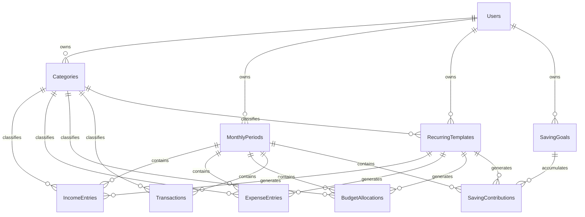

# DATABASE_DESIGN.md — MoneyFlow (Microsoft SQL Server)

Database name: `MoneyFlowDb`. All money columns use `DECIMAL(18,2)` — never `FLOAT`/`REAL`. All dates are Gregorian (`DATE` or `DATETIME2(3)`); Buddhist Era conversion happens only in the frontend.

## 1. Entity-Relationship Diagram



## 2. Table Catalog

| Table | Purpose |
|---|---|
| `Users` | Account credentials & profile |
| `Categories` | Dynamic, user-owned classification for Income/Expense/Saving items |
| `MonthlyPeriods` | One row per user per calendar month (the financial period) |
| `RecurringTemplates` | Definitions that get copied into a new month |
| `IncomeEntries` | Actual income line items within a month |
| `ExpenseEntries` | Simple-mode expense line items (fixed/variable bills) within a month |
| `BudgetAllocations` | Planned monthly amount per Budget-vs-Actual category (e.g., Food = 7,000) |
| `Transactions` | Actual spend entries against a Budget-vs-Actual category |
| `SavingGoals` | Named savings goals (Emergency Fund, Travel, ...) |
| `SavingContributions` | Actual monthly contributions toward a saving goal |

## 3. Table Definitions

### 3.1 Users
| Column | Type | Nullable | Default | Notes |
|---|---|---|---|---|
| UserId | INT IDENTITY(1,1) | NO | | PK |
| Email | NVARCHAR(256) | NO | | UNIQUE |
| PasswordHash | NVARCHAR(256) | NO | | BCrypt hash |
| DisplayName | NVARCHAR(100) | NO | | |
| IsActive | BIT | NO | 1 | |
| CreatedAt | DATETIME2(3) | NO | SYSUTCDATETIME() | |
| UpdatedAt | DATETIME2(3) | NO | SYSUTCDATETIME() | |

Constraints: `PK_Users (UserId)`, `UQ_Users_Email (Email)`.

### 3.2 Categories
| Column | Type | Nullable | Default | Notes |
|---|---|---|---|---|
| CategoryId | INT IDENTITY(1,1) | NO | | PK |
| UserId | INT | NO | | FK → Users |
| Name | NVARCHAR(100) | NO | | |
| Type | VARCHAR(10) | NO | | `Income` \| `Expense` \| `Saving` |
| Classification | VARCHAR(10) | YES | NULL | `Fixed` \| `Variable`; only meaningful when Type=`Expense` |
| TrackingMode | VARCHAR(20) | NO | `Simple` | `Simple` \| `BudgetVsActual` |
| Icon | VARCHAR(50) | YES | NULL | icon key for UI |
| Color | VARCHAR(20) | YES | NULL | hex color for charts/badges |
| SortOrder | INT | NO | 0 | |
| IsActive | BIT | NO | 1 | soft delete |
| CreatedAt | DATETIME2(3) | NO | SYSUTCDATETIME() | |

Constraints/Checks:
- `PK_Categories (CategoryId)`
- `FK_Categories_Users (UserId) REFERENCES Users(UserId) ON DELETE CASCADE`
- `CK_Categories_Type CHECK (Type IN ('Income','Expense','Saving'))`
- `CK_Categories_Classification CHECK (Classification IS NULL OR Classification IN ('Fixed','Variable'))`
- `CK_Categories_TrackingMode CHECK (TrackingMode IN ('Simple','BudgetVsActual'))`
- `UQ_Categories_User_Name (UserId, Name)` — prevent duplicate category names per user

### 3.3 MonthlyPeriods
| Column | Type | Nullable | Default | Notes |
|---|---|---|---|---|
| MonthlyPeriodId | INT IDENTITY(1,1) | NO | | PK |
| UserId | INT | NO | | FK → Users |
| Year | SMALLINT | NO | | Gregorian year, e.g. 2026 |
| Month | TINYINT | NO | | 1–12 |
| CreatedAt | DATETIME2(3) | NO | SYSUTCDATETIME() | |

Constraints:
- `PK_MonthlyPeriods (MonthlyPeriodId)`
- `FK_MonthlyPeriods_Users (UserId) REFERENCES Users(UserId) ON DELETE CASCADE`
- `CK_MonthlyPeriods_Month CHECK (Month BETWEEN 1 AND 12)`
- `UQ_MonthlyPeriods_User_Year_Month (UserId, Year, Month)`

### 3.4 RecurringTemplates
| Column | Type | Nullable | Default | Notes |
|---|---|---|---|---|
| RecurringTemplateId | INT IDENTITY(1,1) | NO | | PK |
| UserId | INT | NO | | FK → Users |
| TargetType | VARCHAR(20) | NO | | `Income` \| `ExpenseEntry` \| `BudgetAllocation` \| `SavingContribution` |
| CategoryId | INT | YES | NULL | FK → Categories; required when TargetType ∈ {Income, ExpenseEntry, BudgetAllocation} |
| SavingGoalId | INT | YES | NULL | FK → SavingGoals; required when TargetType = `SavingContribution` |
| Name | NVARCHAR(150) | NO | | e.g. "Room Internet" |
| Amount | DECIMAL(18,2) | NO | | default amount copied into generated entry |
| Classification | VARCHAR(10) | YES | NULL | copied to ExpenseEntry.Classification when relevant |
| DueDay | TINYINT | YES | NULL | 1–31, clipped to actual month length |
| IsActive | BIT | NO | 1 | |
| SortOrder | INT | NO | 0 | |
| CreatedAt | DATETIME2(3) | NO | SYSUTCDATETIME() | |
| UpdatedAt | DATETIME2(3) | NO | SYSUTCDATETIME() | |

Constraints:
- `PK_RecurringTemplates (RecurringTemplateId)`
- `FK_RecurringTemplates_Users (UserId) REFERENCES Users(UserId) ON DELETE CASCADE`
- `FK_RecurringTemplates_Categories (CategoryId) REFERENCES Categories(CategoryId) ON DELETE NO ACTION`
- `FK_RecurringTemplates_SavingGoals (SavingGoalId) REFERENCES SavingGoals(SavingGoalId) ON DELETE NO ACTION`
- `CK_RecurringTemplates_TargetType CHECK (TargetType IN ('Income','ExpenseEntry','BudgetAllocation','SavingContribution'))`
- `CK_RecurringTemplates_TargetRef CHECK ((TargetType = 'SavingContribution' AND SavingGoalId IS NOT NULL AND CategoryId IS NULL) OR (TargetType <> 'SavingContribution' AND CategoryId IS NOT NULL AND SavingGoalId IS NULL))`

### 3.5 IncomeEntries
| Column | Type | Nullable | Default | Notes |
|---|---|---|---|---|
| IncomeEntryId | INT IDENTITY(1,1) | NO | | PK |
| UserId | INT | NO | | FK → Users (denormalized, see §5) |
| MonthlyPeriodId | INT | NO | | FK → MonthlyPeriods |
| CategoryId | INT | NO | | FK → Categories (Type=Income) |
| Name | NVARCHAR(150) | NO | | e.g. "September Salary" |
| Amount | DECIMAL(18,2) | NO | | |
| IncomeDate | DATE | NO | | |
| IsRecurring | BIT | NO | 0 | |
| RecurringTemplateId | INT | YES | NULL | FK → RecurringTemplates, `ON DELETE NO ACTION` (app nulls link on template delete) |
| Note | NVARCHAR(500) | YES | NULL | |
| IsActive | BIT | NO | 1 | |
| CreatedAt | DATETIME2(3) | NO | SYSUTCDATETIME() | |
| UpdatedAt | DATETIME2(3) | NO | SYSUTCDATETIME() | |

### 3.6 ExpenseEntries
| Column | Type | Nullable | Default | Notes |
|---|---|---|---|---|
| ExpenseEntryId | INT IDENTITY(1,1) | NO | | PK |
| UserId | INT | NO | | FK → Users (denormalized) |
| MonthlyPeriodId | INT | NO | | FK → MonthlyPeriods |
| CategoryId | INT | NO | | FK → Categories (Type=Expense, TrackingMode=Simple) |
| Name | NVARCHAR(150) | NO | | e.g. "ค่าห้อง" |
| Amount | DECIMAL(18,2) | NO | | |
| Classification | VARCHAR(10) | NO | | `Fixed` \| `Variable` |
| DueDate | DATE | YES | NULL | |
| IsPaid | BIT | NO | 0 | |
| PaidDate | DATE | YES | NULL | |
| IsRecurring | BIT | NO | 0 | |
| RecurringTemplateId | INT | YES | NULL | FK → RecurringTemplates, `ON DELETE NO ACTION` (app nulls link on template delete) |
| Note | NVARCHAR(500) | YES | NULL | |
| SortOrder | INT | NO | 0 | |
| CreatedAt | DATETIME2(3) | NO | SYSUTCDATETIME() | |
| UpdatedAt | DATETIME2(3) | NO | SYSUTCDATETIME() | |

Check: `CK_ExpenseEntries_Classification CHECK (Classification IN ('Fixed','Variable'))`.

### 3.7 BudgetAllocations
| Column | Type | Nullable | Default | Notes |
|---|---|---|---|---|
| BudgetAllocationId | INT IDENTITY(1,1) | NO | | PK |
| UserId | INT | NO | | FK → Users (denormalized) |
| MonthlyPeriodId | INT | NO | | FK → MonthlyPeriods |
| CategoryId | INT | NO | | FK → Categories (Type=Expense, TrackingMode=BudgetVsActual) |
| AllocatedAmount | DECIMAL(18,2) | NO | | planning figure, e.g. 7,000 for Food |
| IsRecurring | BIT | NO | 0 | |
| RecurringTemplateId | INT | YES | NULL | FK → RecurringTemplates, `ON DELETE NO ACTION` (app nulls link on template delete) |
| Note | NVARCHAR(500) | YES | NULL | |
| CreatedAt | DATETIME2(3) | NO | SYSUTCDATETIME() | |
| UpdatedAt | DATETIME2(3) | NO | SYSUTCDATETIME() | |

Constraint: `UQ_BudgetAllocations_Period_Category (MonthlyPeriodId, CategoryId)` — one allocation per category per month.

### 3.8 Transactions
| Column | Type | Nullable | Default | Notes |
|---|---|---|---|---|
| TransactionId | INT IDENTITY(1,1) | NO | | PK |
| UserId | INT | NO | | FK → Users (denormalized) |
| MonthlyPeriodId | INT | NO | | FK → MonthlyPeriods |
| CategoryId | INT | NO | | FK → Categories (TrackingMode=BudgetVsActual) — actual spend against a budget category |
| Amount | DECIMAL(18,2) | NO | | |
| TransactionDate | DATE | NO | | |
| Description | NVARCHAR(255) | NO | | e.g. "Week 2 groceries" |
| Note | NVARCHAR(500) | YES | NULL | |
| CreatedAt | DATETIME2(3) | NO | SYSUTCDATETIME() | |
| UpdatedAt | DATETIME2(3) | NO | SYSUTCDATETIME() | |

### 3.9 SavingGoals
| Column | Type | Nullable | Default | Notes |
|---|---|---|---|---|
| SavingGoalId | INT IDENTITY(1,1) | NO | | PK |
| UserId | INT | NO | | FK → Users |
| CategoryId | INT | YES | NULL | optional FK → Categories (Type=Saving) for chart grouping |
| Name | NVARCHAR(150) | NO | | e.g. "Emergency Fund" |
| TargetAmount | DECIMAL(18,2) | YES | NULL | |
| TargetDate | DATE | YES | NULL | |
| PlannedMonthlyContribution | DECIMAL(18,2) | YES | NULL | used by recurring copy |
| IsActive | BIT | NO | 1 | |
| SortOrder | INT | NO | 0 | |
| CreatedAt | DATETIME2(3) | NO | SYSUTCDATETIME() | |

Constraint: `FK_SavingGoals_Users (UserId) REFERENCES Users(UserId) ON DELETE CASCADE`; `FK_SavingGoals_Categories (CategoryId) REFERENCES Categories(CategoryId) ON DELETE NO ACTION`.

### 3.10 SavingContributions
| Column | Type | Nullable | Default | Notes |
|---|---|---|---|---|
| SavingContributionId | INT IDENTITY(1,1) | NO | | PK |
| UserId | INT | NO | | FK → Users (denormalized) |
| MonthlyPeriodId | INT | NO | | FK → MonthlyPeriods |
| SavingGoalId | INT | NO | | FK → SavingGoals |
| Amount | DECIMAL(18,2) | NO | | |
| ContributionDate | DATE | NO | | |
| IsRecurring | BIT | NO | 0 | |
| RecurringTemplateId | INT | YES | NULL | FK → RecurringTemplates, `ON DELETE NO ACTION` (app nulls link on template delete) |
| Note | NVARCHAR(500) | YES | NULL | |
| CreatedAt | DATETIME2(3) | NO | SYSUTCDATETIME() | |

## 4. Indexes

| Index | Table | Columns | Reason |
|---|---|---|---|
| `IX_Categories_User_Type` | Categories | (UserId, Type, IsActive) | category pickers filtered by type per user |
| `IX_MonthlyPeriods_User_Year_Month` | MonthlyPeriods | (UserId, Year, Month) UNIQUE | month lookup/navigation (also serves uniqueness) |
| `IX_IncomeEntries_Period` | IncomeEntries | (MonthlyPeriodId) INCLUDE (Amount) | dashboard TotalIncome aggregation |
| `IX_ExpenseEntries_Period` | ExpenseEntries | (MonthlyPeriodId) INCLUDE (Amount, Classification, IsPaid) | dashboard totals + paid/unpaid widget |
| `IX_BudgetAllocations_Period_Category` | BudgetAllocations | (MonthlyPeriodId, CategoryId) UNIQUE | uniqueness + per-category lookup |
| `IX_Transactions_Period_Category` | Transactions | (MonthlyPeriodId, CategoryId) INCLUDE (Amount) | Actual-used sums per category/month |
| `IX_Transactions_Period_Date` | Transactions | (MonthlyPeriodId, TransactionDate) | recent-transactions lists |
| `IX_SavingContributions_Goal` | SavingContributions | (SavingGoalId) INCLUDE (Amount) | accumulated-amount rollups |
| `IX_SavingContributions_Period` | SavingContributions | (MonthlyPeriodId) INCLUDE (Amount) | monthly savings totals |
| `IX_RecurringTemplates_User_Active` | RecurringTemplates | (UserId, IsActive) | "create next month" copy query |

No index is added on low-cardinality boolean-only columns in isolation (e.g., a lone `IsActive` index) — they're combined into composite indexes above based on actual query patterns.

## 5. Delete Behavior — Cascade Path Design

SQL Server rejects multiple cascade paths to the same table. Because most child tables can be reached from `Users` both directly (denormalized `UserId`) and indirectly (`Users → MonthlyPeriods → child`), the rule applied throughout this schema is:

- **Cascade only through the "natural" ownership chain**: `Users → MonthlyPeriods → {IncomeEntries, ExpenseEntries, BudgetAllocations, Transactions, SavingContributions}` all `ON DELETE CASCADE`.
- **The denormalized direct `UserId` FK on those same child tables is `ON DELETE NO ACTION`** (it exists purely to make single-table queries/authorization checks fast without a join; the cascade already happens via `MonthlyPeriodId`).
- `Users → Categories`, `Users → SavingGoals`, `Users → RecurringTemplates`: `ON DELETE CASCADE` (single path, no conflict).
- `SavingGoals → SavingContributions` via `SavingGoalId`: `ON DELETE NO ACTION` (contributions are already cascaded via `MonthlyPeriodId`; deleting a goal with existing contributions should be blocked at the service layer — soft delete via `IsActive` instead).
- `Categories → {IncomeEntries, ExpenseEntries, BudgetAllocations, Transactions, RecurringTemplates}` via `CategoryId`: `ON DELETE NO ACTION` — a category in use cannot be hard-deleted; the API only allows deactivating it (`IsActive = 0`).
- `RecurringTemplates → {IncomeEntries, ExpenseEntries, BudgetAllocations, SavingContributions}` via `RecurringTemplateId`: `ON DELETE NO ACTION`. SQL Server rejects `SET NULL` here (multiple cascade paths via `Users` + `MonthlyPeriods`). The API nulls `RecurringTemplateId` on those rows, then deletes the template; financial history is kept.

Practical effect: deleting a `User` cascades cleanly through `MonthlyPeriods` down to all transactional data, plus directly removes `Categories`, `SavingGoals`, `RecurringTemplates`. Deleting a single `MonthlyPeriod` cascades only its own entries. Deleting a `Category` or `SavingGoal` is blocked by the service layer while referenced (enforced by `NO ACTION` FK + a friendly 409 from the API rather than a raw SQL error).

## 6. Accounting Calculation Rules (SQL-level)

These mirror PROJECT_SPEC.md §5 and are implemented once in the backend Service layer (`MonthlySummaryService`), backed by these queries:

```sql
-- Total income for a month
SELECT ISNULL(SUM(Amount), 0) AS TotalIncome
FROM IncomeEntries
WHERE MonthlyPeriodId = @MonthlyPeriodId AND IsActive = 1;

-- Total expenses = simple entries + actual transactions against expense-type budget categories
SELECT
    (SELECT ISNULL(SUM(ee.Amount), 0)
     FROM ExpenseEntries ee
     WHERE ee.MonthlyPeriodId = @MonthlyPeriodId)
    +
    (SELECT ISNULL(SUM(t.Amount), 0)
     FROM Transactions t
     INNER JOIN Categories c ON c.CategoryId = t.CategoryId
     WHERE t.MonthlyPeriodId = @MonthlyPeriodId AND c.Type = 'Expense')
    AS TotalExpenses;

-- Fixed vs Variable breakdown (simple entries use their own Classification;
-- budget-category transactions use the category's Classification)
SELECT
    Classification,
    SUM(Amount) AS Total
FROM (
    SELECT ee.Classification, ee.Amount
    FROM ExpenseEntries ee
    WHERE ee.MonthlyPeriodId = @MonthlyPeriodId

    UNION ALL

    SELECT c.Classification, t.Amount
    FROM Transactions t
    INNER JOIN Categories c ON c.CategoryId = t.CategoryId
    WHERE t.MonthlyPeriodId = @MonthlyPeriodId AND c.Type = 'Expense'
) x
GROUP BY Classification;

-- Total savings for a month
SELECT ISNULL(SUM(Amount), 0) AS TotalSavings
FROM SavingContributions
WHERE MonthlyPeriodId = @MonthlyPeriodId;

-- Per-category Budget / Used / Remaining (e.g., Food, Reward)
SELECT
    ba.CategoryId,
    ba.AllocatedAmount,
    ISNULL(SUM(t.Amount), 0) AS ActualUsed,
    ba.AllocatedAmount - ISNULL(SUM(t.Amount), 0) AS Remaining
FROM BudgetAllocations ba
LEFT JOIN Transactions t
    ON t.CategoryId = ba.CategoryId AND t.MonthlyPeriodId = ba.MonthlyPeriodId
WHERE ba.MonthlyPeriodId = @MonthlyPeriodId
GROUP BY ba.CategoryId, ba.AllocatedAmount;

-- Remaining money for the month
-- RemainingMoney = TotalIncome - TotalExpenses - TotalSavings   (computed in the Service layer
-- from the three queries above; BudgetAllocations.AllocatedAmount is NEVER included here)
```

**Double-counting guard rails:**
1. `BudgetAllocations.AllocatedAmount` is read only in the "per-category remaining" query — never summed into `TotalExpenses` or `RemainingMoney`.
2. A category is either `Simple` (uses `ExpenseEntries`) or `BudgetVsActual` (uses `BudgetAllocations` + `Transactions`) — the API rejects creating an `ExpenseEntry` against a `BudgetVsActual` category and rejects a `Transaction` against a `Simple` category (validated in the Service layer against `Categories.TrackingMode`).
3. Savings never appear in `ExpenseEntries`/`Transactions` — they exclusively use `SavingContributions`, keeping `TotalExpenses` and `TotalSavings` disjoint sets.

## 7. SQL Script Plan (`/database/sql`)

| File | Contents |
|---|---|
| `001_create_database.sql` | `CREATE DATABASE MoneyFlowDb` (guarded by `IF NOT EXISTS`), sets recommended collation `SQL_Latin1_General_CP1_CI_AS` (fine for Thai text stored as NVARCHAR) |
| `002_create_tables.sql` | All `CREATE TABLE` statements from §3, in FK-safe order: Users → Categories → MonthlyPeriods → RecurringTemplates → SavingGoals → IncomeEntries → ExpenseEntries → BudgetAllocations → Transactions → SavingContributions |
| `003_create_indexes.sql` | All indexes from §4 (tables already have PK/UNIQUE constraints from 002; this file adds the non-constraint performance indexes) |
| `004_seed_data.sql` | One demo user + starter categories + one populated `MonthlyPeriod` (September 2026) built from the real-world use case in PROJECT_SPEC.md §3, plus one prior month (August 2026) with lighter data so dashboard trend charts have something to render |

Each script is idempotent where practical (`IF NOT EXISTS` guards) so it can be re-run safely during development.

## 8. Sample Seed Data (September 2026, matches real use case)

| Category | TrackingMode | Entry | Amount (THB) |
|---|---|---|---|
| Rent | Simple/Variable | ExpenseEntry "ค่าห้อง" | 7,200.00 |
| Phone | Simple/Fixed | ExpenseEntry "เติมเน็ตโทรศัพท์" | 250.00 |
| Internet | Simple/Fixed | ExpenseEntry "จ่ายค่าเน็ตห้อง" | 1,068.93 |
| Credit Card | Simple/Fixed | ExpenseEntry "บัตรเครดิตกรุงศรี" | 2,614.00 |
| Cash Card | Simple/Fixed | ExpenseEntry "บัตรกดเงินสดกสิกร" | 7,111.92 |
| Credit Card | Simple/Fixed | ExpenseEntry "บัตรเครดิตกสิกร" | 3,285.48 |
| Food | BudgetVsActual | BudgetAllocation | 7,000.00 |
| Food | BudgetVsActual | Transaction "Week 1 groceries" | 600.00 |
| Food | BudgetVsActual | Transaction "Week 2 groceries" | 520.00 |
| Food | BudgetVsActual | Transaction "Week 3 groceries" | 640.00 |
| Food | BudgetVsActual | Transaction "Week 4 groceries" | 570.00 |
| Reward | BudgetVsActual | BudgetAllocation | 2,000.00 |
| Salary | Income | IncomeEntry "September Salary" | 40,000.00 |
| General Savings | Saving | SavingContribution | 5,000.00 |

This gives: TotalIncome = 40,000.00; TotalExpenses = 7,200 + 250 + 1,068.93 + 2,614 + 7,111.92 + 3,285.48 + (600+520+640+570) = 23,860.33; TotalSavings = 5,000.00; RemainingMoney = 11,139.67. (Numbers intentionally close to, but not required to exactly equal, the illustrative 40k/20k/5k unit test fixture — the unit test in TASKS.md Phase 11 uses clean round numbers precisely to make the expected result easy to verify.)
