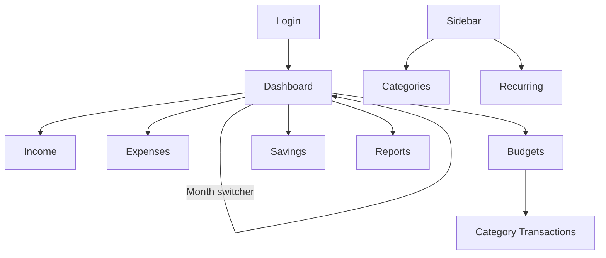

# UI_UX_SPEC.md — MoneyFlow

## 1. Design Principles

1. Numbers first — every screen answers "how much do I have left?" within one glance.
2. Progressive disclosure — simple totals up front, details one tap/click away.
3. Never make the user type more than necessary (smart defaults, quick-add, recurring copy).
4. Desktop and mobile are two intentional layouts, not one squeezed into the other.
5. Consistent semantic color: green = healthy/positive, amber = caution, red = over-budget/negative.

## 2. Visual Style

| Token | Value |
|---|---|
| Background | `#F7F8FA` (light neutral) |
| Surface/card | `#FFFFFF`, border `#E5E7EB`, radius `12px`, shadow `0 1px 2px rgba(16,24,40,0.06)` |
| Primary | `#2F6FED` (blue — brand/actions) |
| Success/positive | `#16A34A` (remaining money, under budget) |
| Warning | `#D97706` (approaching budget limit, e.g. >80% used) |
| Danger | `#DC2626` (over budget, unpaid overdue) |
| Text primary | `#111827` |
| Text secondary | `#6B7280` |
| Font | Inter / system-ui stack, AntD default with Tailwind `font-sans` |
| Numeric font | tabular-nums for all amount displays (alignment in tables) |
| Currency format | `฿12,345.67` — `Intl.NumberFormat('th-TH', { style: 'currency', currency: 'THB' })` |

Ant Design theme is customized via `ConfigProvider theme={{ token: { colorPrimary: '#2F6FED', borderRadius: 12 } }}`; Tailwind handles spacing/layout utility classes around AntD components (no visual clash — Tailwind's `preflight` is scoped to avoid overriding AntD base styles).

## 3. Layout Shells

### 3.1 Desktop (≥1024px)
```
┌───────────────────────────────────────────────────────────┐
│ Topbar: Logo | Month Switcher (‹ Sep 2026 ›) | User menu   │
├───────────┬─────────────────────────────────────────────────┤
│ Sidebar   │  Page content (max-width 1200px, centered)      │
│ Dashboard │                                                  │
│ Income    │                                                  │
│ Expenses  │                                                  │
│ Budgets   │                                                  │
│ Savings   │                                                  │
│ Categories│                                                  │
│ Recurring │                                                  │
│ Reports   │                                                  │
└───────────┴─────────────────────────────────────────────────┘
```
Sidebar collapsible (icon-only mode) via Zustand `ui.store`.

### 3.2 Mobile (<768px)
```
┌───────────────────────────────┐
│ Topbar: ‹ Sep 2026 ›   ☰       │
├───────────────────────────────┤
│  Page content (single column,  │
│  card list instead of tables)  │
│                                 │
│                    ＋ (FAB)     │
├───────────────────────────────┤
│ Bottom nav: Home Budgets +  Savings More │
└───────────────────────────────┘
```
- Bottom navigation: `Dashboard`, `Budgets` (Food/Reward quick view), central `+` FAB for quick-add, `Savings`, `More` (Income/Expenses/Categories/Recurring/Reports/Logout collapsed into a sheet).
- Tables become stacked cards below 768px (see §5.3).

## 4. Screens

### 4.1 Login / Register
- Centered card, email + password, "Log in" primary button.
- Minimal register link/toggle (email, password, display name).
- Inline validation (Zod + React Hook Form), password visibility toggle.
- No "forgot password" flow in v1 (documented out of scope) — show a small note "Contact admin to reset password" only if needed later.

### 4.2 Dashboard (`/`)
- Month switcher at top (`‹ Aug 2026 | Sep 2026 | Oct 2026 ›`); if the target month doesn't exist yet, switching to it shows an empty state with two buttons: **Start Empty Month** and **Copy Recurring Items** (maps to `POST /months`).
- KPI stat cards row (responsive grid, 2 cols mobile / 4 cols desktop): Income, Expenses, Savings, Remaining — Remaining card colored green/red based on sign.
- Secondary row: Food (Budget/Used/Remaining mini progress bar), Reward (same pattern), Paid/Unpaid expense count with a link to Expenses filtered by unpaid.
- Monthly progress bar: "Day 25 of 30 (83%)".
- Charts grid (2×2 desktop, stacked mobile): Income vs Expenses vs Savings (bar), Expense breakdown (donut + legend), Remaining trend (line), Fixed vs Variable (bar).
- Loading state: skeleton cards + skeleton chart placeholders (AntD `Skeleton`).
- Empty state (brand-new user, no data): friendly illustration + "Add your first income" / "Add your first expense" CTAs.

### 4.3 Income (`/income`)
- Table (desktop) / card list (mobile) of income entries for the selected month: Name, Category, Amount, Date, Recurring badge, Active toggle, row actions (edit/delete).
- "+ Add Income" opens a modal/drawer form (name, category select w/ inline "create new category", amount, date, recurring checkbox, note).
- Category select uses AntD `Select` with `showSearch` and an "＋ Create '{query}'" option (dynamic categories, no hard-coding).

### 4.4 Expenses (`/expenses`)
- Filter chips: All / Fixed / Variable / Paid / Unpaid.
- Table columns (desktop): Name, Category, Classification badge, Amount, Due Date, Status (Paid/Unpaid toggle switch inline), Actions.
- Mobile: card per expense — name+amount top line, category+due date second line, Paid switch and menu (⋮) for edit/delete.
- Drag-to-reorder on desktop (updates `SortOrder` via `PUT /expenses/reorder`); mobile uses an explicit "Reorder" mode with up/down buttons instead of drag (touch drag reordering is error-prone — simplicity over cleverness).
- "+ Add Expense" form mirrors Income but adds Classification (Fixed/Variable segmented control) and Due Date.

### 4.5 Budgets (`/budgets`) — Food, Reward, Shopping, etc.
- One card per Budget-vs-Actual category: category name, progress bar (Used/Allocated), amounts "Used ฿2,330 of ฿7,000", "฿4,670 left", color shifts amber at 80%, red at 100%+.
- Tapping a card opens the category's transaction list (desktop: side drawer; mobile: full-screen sheet) with a running list of individual transactions and a quick-add input pinned to the bottom.
- "+ Set Allocation" for categories without one yet this month.

### 4.6 Quick-Add (Transactions) — the mobile-first interaction
- FAB (mobile) or a persistent "+ Quick Add" button (desktop, top-right of Budgets page).
- Bottom sheet (mobile) / small modal (desktop) with exactly 3 required fields: Category (defaults to last used, e.g. "Food"), Amount (numeric keypad on mobile via `inputMode="decimal"`), Description (optional, placeholder "e.g. Week 3 groceries").
- One-tap submit → success toast "Added ฿620 to Food" with an "Undo" action (soft — calls delete on the just-created transaction id).
- Designed to be completable in under ~4 taps total on mobile.

### 4.7 Savings (`/savings`)
- Card per goal: name, progress ring or bar (Accumulated / Target, or just Accumulated if no target), "This month: ฿5,000 contributed", planned monthly contribution shown as a subtle hint.
- "+ Contribute" quick action per goal card.
- "+ New Goal" form: name, target amount (optional), target date (optional), planned monthly contribution (optional).

### 4.8 Categories (`/categories`)
- Simple settings-style list grouped by Type tabs (Income / Expense / Saving).
- Each row: color dot, name, classification/tracking badges, active switch, edit/delete.
- "+ Add Category" inline form: name, type, (if Expense) classification + tracking mode radio ("Simple bill" vs "Budget with actual spending").

### 4.9 Recurring Items (`/recurring`)
- List grouped by target type (Income / Bills / Budgets / Savings), each row: name, amount, due day, active switch.
- Explains itself with a short helper line: "These are copied automatically when you create a new month with 'Copy Recurring Items'."

### 4.10 Reports (`/reports`)
- Month range selector (3/6/12 months).
- Larger versions of dashboard charts 1 & 3, plus a simple comparison table across months (Income, Expenses, Savings, Remaining per row) — this table becomes a horizontally-scrollable card carousel on mobile rather than a squeezed table.

## 5. Component Patterns

### 5.1 StatCard
Label (secondary text) + big number (tabular-nums, 24–28px) + optional trend delta vs last month (small colored arrow + %).

### 5.2 Budget Progress Card
Category name + icon, thin progress bar (rounded), "Used / Allocated" caption, remaining amount emphasized, color rule: `<80%` green, `80–100%` amber, `>100%` red.

### 5.3 Responsive Table → Card List
Any dataset with >4 columns uses a shared `ResponsiveTable` component:
- ≥768px: real AntD `Table` with sorting.
- <768px: renders the same row data as a vertical list of `Card`s with a primary line (name + amount) and a secondary line (metadata), tapping opens the same edit drawer used on desktop.

### 5.4 Month Switcher
Shared component used in topbar and Reports; keyboard accessible (`←`/`→` when focused moves months on desktop).

### 5.5 Empty States
Icon/illustration + one-sentence explanation + a single primary CTA button. Never a bare blank table.

### 5.6 Loading Skeletons
AntD `Skeleton` for cards/lists; `Skeleton.Node` sized to chart areas while data loads via TanStack Query's `isLoading`.

### 5.7 Toasts
AntD `message`/`notification` for success ("Expense added"), error ("Couldn't save — check your connection"), and undo actions (quick-add).

### 5.8 Destructive Confirmation
AntD `Modal.confirm` for delete actions ("Delete 'Netflix'? This can't be undone.") — never a silent delete.

### 5.9 Forms
React Hook Form + Zod resolver; inline field errors under each input; submit button shows a loading spinner and disables during mutation (`useMutation` from TanStack Query).

## 6. Mobile-Specific Interactions

- FAB for quick-add is always reachable from Dashboard, Budgets, and Savings tabs.
- Numeric inputs use `inputMode="decimal"` to trigger the numeric keyboard.
- Swipe gestures are intentionally NOT used for delete (error-prone); use an explicit menu (⋮) instead, per simplicity priority.
- Bottom sheets use native-feeling slide-up animation (AntD `Drawer placement="bottom"`).

## 7. Navigation Map



## 8. Accessibility

- All interactive elements reachable by keyboard (Tab order follows visual order); modals trap focus (AntD default).
- Color is never the only signal — budget status also shows text ("Over budget by ฿120") alongside color.
- Minimum contrast ratio 4.5:1 for body text against background.
- Form inputs always have associated `<label>` (AntD `Form.Item label=`).

## 9. Responsive Breakpoints (Tailwind defaults, used consistently)

| Breakpoint | Width | Behavior |
|---|---|---|
| Base | <640px | Single column, bottom nav, FAB, card lists |
| sm/md | 640–1023px | Single column content, wider cards, tables start appearing (768px) |
| lg+ | ≥1024px | Sidebar + topbar shell, multi-column dashboard grid, full tables |
